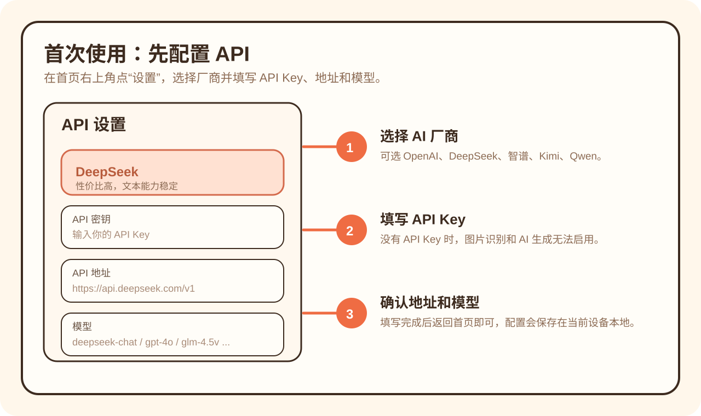
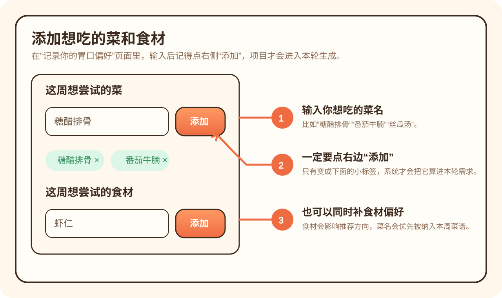
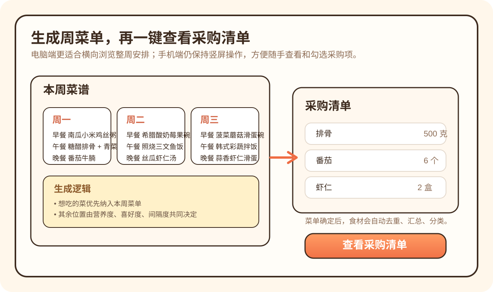

# 🍽️ WeekEat｜吃什么

一个真正解决“吃什么”、“怎么吃”、“买什么”的 AI 智能菜谱助手。

告别繁琐的手动输入式“菜谱收纳工具”，结合 **大模型能力、可解释的推荐算法、本地可持续迭代的菜谱库**，构建一个能够长期使用、持续学习、逐步贴合个人习惯的动态膳食规划系统。

---

## 🎯 三大核心亮点

### 1️⃣ 智能推荐一周菜谱，兼顾营养与个人喜好

由本地算法智能编排：

- **将你想吃的菜纳入本周菜单**

  注重营养，更注重你的喜好！生成一周菜谱前，你可以通过文字或图片形式简述你想吃的菜或食材，系统会自动将其纳入到本周菜单中。

- **均衡营养 + 个人偏好 + 荤素搭配**  

  推荐度由「营养度 × 喜好度 × 间隔度」的连续函数建模：

  - **营养度** 根据膳食指南综合评估宏量营养素配比、热量、蛋白质密度、蔬果纤维等因素，并根据你的减脂/增肌/养胃/控糖等健康目标动态调整
  - **喜好度** 融合了你的即时输入、长期偏爱、标签/食材匹配度以及历史推荐基线，越符合你口味的菜权重越高
  - **间隔度** 让推荐结果更具多样性，避免一直吃同样的菜；而且间隔度的权重会受喜好度调制——你喜欢的菜，间隔时间长后回升更快

- **规则明确，结果可控**  

  每餐遵循荤素搭配、完整一餐与多菜搭配的规则，全周尽量不重复，拒绝机械随机。

### 2️⃣ 一键生成周度采购清单，一站式备菜

确定周菜单后，系统自动汇总整周食材：

- 自动去重
- 自动整合同类食材
- 对应到实际菜谱生成结果

实现「想吃什么 → 一周怎么吃 → 该买什么」的完整闭环，告别买菜纠结、食材浪费和重复采购。

### 3️⃣ 本地持久菜谱库，越用越懂你

拒绝一次性生成器，持续迭代你的私人智能菜谱库！

- 你想吃的新菜，ai会帮你自动补全信息并加入本地库
- AI对话会更新你的饮食偏好画像
- 菜谱标签、偏好权重、推荐度会随使用历史持续演化
- 库中的菜会越来越贴合你的个人习惯

---

## 📥 快速安装


### Windows 电脑端

桌面端提供两种安装包：

1. **安装版**（推荐）

   - 下载 `WeekEat Setup 1.0.0.exe`
   - 双击运行，按提示下一步安装
   - 安装完成后从桌面或开始菜单打开
   - （如果弹出“未知发布者”提示，选择“更多信息”→“仍要运行”即可）

2. **便携版**

   - 下载 `WeekEat 1.0.0.exe`
   - 直接双击运行，无需安装
   - 适合临时使用或放在 U 盘带走

### Android 手机端

1. 下载 Android 安装包 `WeekEat Android 1.0.0.apk` 到手机
2. 在手机上点开安装
3. 如果系统拦截，在设置里允许“安装未知来源应用”
4. 安装完成后直接打开

---

## 📘 使用说明

### 1. 配置 API

首次打开后，建议先点首页右上角的 **设置**，选择你要使用的 AI 厂商，并填写对应的 API Key、API 地址和模型名称。

- 没有配置 API 时，AI 图像识别、AI 生成和 AI 对话都无法正常启用
- 配置会保存在当前设备本地，下次打开无需重新填写



### 2. 添加你这周想吃的菜或食材

进入“记录你的胃口偏好”页面后，你可以输入：

- 这周想吃的菜
- 这周想尝试的食材
- 或者直接上传想吃的菜的图片

这里有一个很重要的小细节：

> **输入后记得点右边的“添加”按钮。**  
> 只有变成下面的小标签之后，系统才会把它当成你本轮真实的需求。



### 3. 生成一周菜谱

把想吃的菜、想用的食材补充好之后，点底部的 **生成一周菜谱**。

系统会综合考虑：

- 你本轮明确提出的菜和食材
- 你的长期偏好
- 营养均衡目标
- 荤素搭配和全周尽量不重复的规则

如果你本轮明确说了“想吃什么”，系统会优先把这些内容纳入本周菜单。

### 4. 查看采购清单，一站式备菜

周菜单生成完成后，可以直接进入采购清单页面。

- 系统会自动汇总整周食材
- 自动去重、整合同类食材
- 方便你按清单一次性采购



---

## ✨ 更多产品特性

- **真 AI 全自动生成，告别手动录入**

  支持自然语言直接输入需求、图片上传识别菜品与食材，AI自动生成菜谱结构、食材、步骤、营养信息和标签。

- **多模态、可定制的周度餐单规划**  

  你可以指定想吃的菜、想用的食材、口味偏好、忌口、健康目标，也可以上传美食图片进行识别和复刻。

- **开放式 AI 对话交互系统**  

  内置专属AI对话入口，你可以随时调整口味、忌口、荤素偏好、减脂/增肌/养生等膳食需求，这些输入会全局更新后续推荐逻辑。

---

## 🧠 推荐算法亮点

我们采用了 **AI补库 + 本地推荐算法生成** 的混合架构。

- AI负责识别、规范化、补全菜谱与营养信息
- 本地算法负责周菜单生成、约束控制、推荐度演化和最终兜底

### 推荐度计算模型

当前推荐度模型采用的是一个带明确上下界的连续函数，核心分解为3个连续变量：

```text
finalScore = f(
  营养度 nutritionFit,
  喜好度 preferenceFit,
  间隔度 recencyFit
)
```

#### 1. 营养度 nutritionFit

营养度会综合考虑：

- 宏量营养素与目标比例的偏差
- 单餐热量是否合理
- 蛋白质密度
- 蔬果与纤维信号
- 健康目标（如减脂、增肌、养胃、控糖）

它在模型里起到一个“硬闸门”的作用：

> 就算用户很喜欢，如果一道菜明显不够健康，它的最终推荐度也不会高。

#### 2. 喜好度 preferenceFit

喜好度来自多个层面的综合判断：

- 用户本轮输入“想吃”的菜/食材
- AI对话中提取出的长期偏好
- 喜欢或不喜欢的标签
- 菜名、食材与用户偏好的匹配程度
- 菜本身历史推荐基线

这使得系统既能记住“你当前想吃什么”，也能逐渐理解“你长期偏爱什么”。

#### 3. 间隔度 recencyFit

为避免总是推荐同一批高分菜，系统引入了“间隔度”维度：

- 间隔时间长的菜会逐步回升
- 刚连续吃过的菜会明显降下来
- 低分菜不会因为几轮没出现就突然冲成高分

更重要的是：

> 间隔度的影响权重会受到喜好度调制。
> 喜欢的菜，间隔时间长后回升会更快；不喜欢或低分菜，即使间隔时间长，也不会被不合理地抬高。

---

## 🌐 适用场景

- **上班族**：快速生成一周三餐，减少每天纠结吃什么
- **经常做饭的人**：自动整理采购清单，减少重复购买和浪费
- **减脂 / 养生 / 特殊饮食人群**：结合目标生成更平衡的菜单
- **美食爱好者**：看到喜欢的菜，可以通过图片或描述快速纳入个人菜谱体系
